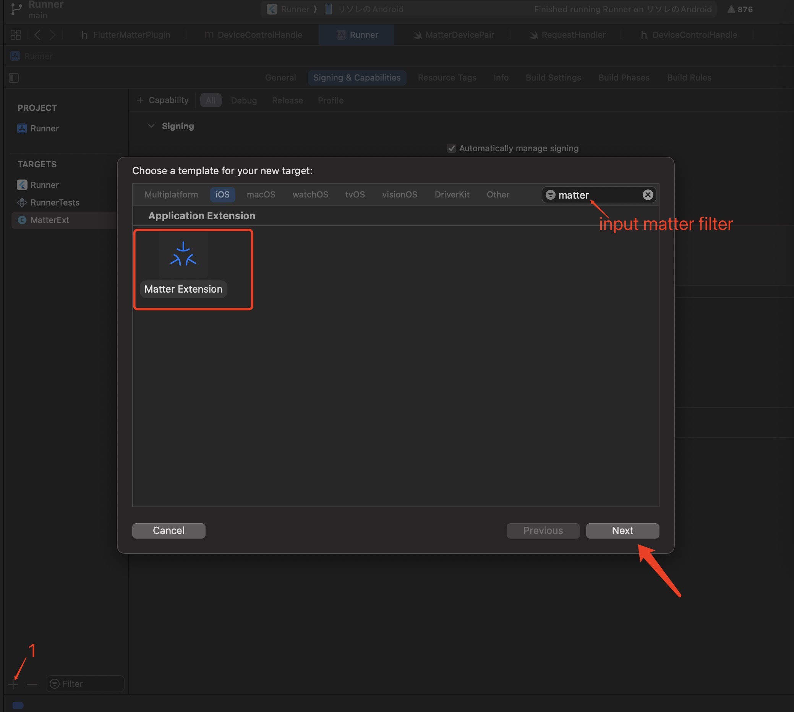
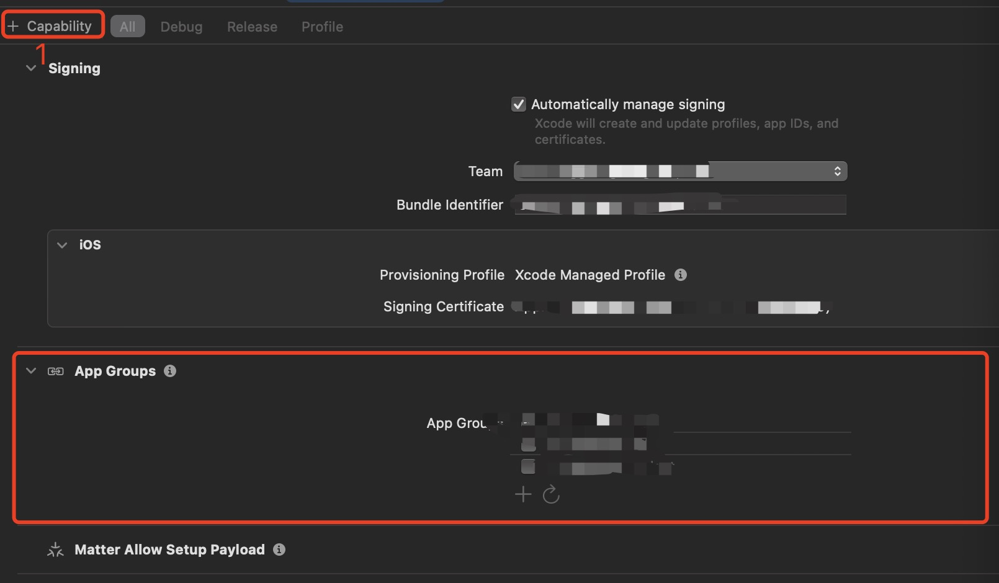
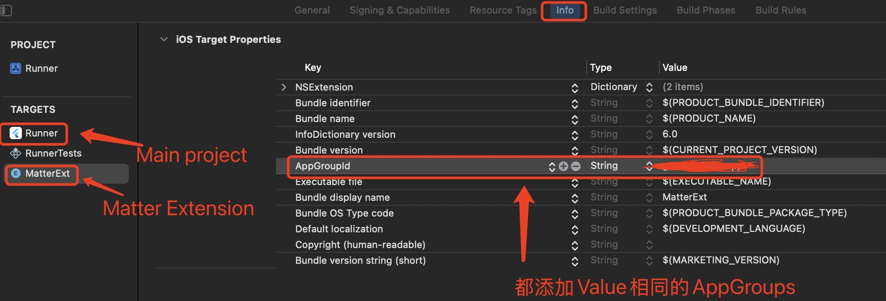

# flutter_matter

[Matter](https://csa-iot.org/) plugin for Flutter Android/Ios


## Features
- Provisioning，安卓可以使用自己的Gatt代码连接和发送matter的配网数据
- Attribute Read
- Attribute Write
- Attribute Subscribe
- Invoke
- 使用最底层的tlv拼装数据, 为开发提供强大的灵活性

## Getting Started


### Android

Ensure the following permission is present in your Android Manifest file

```xml
<!-- Tell Google Play Store that your app uses Bluetooth LE
     Set android:required="true" if bluetooth is necessary -->
<uses-feature android:name="android.hardware.bluetooth_le" android:required="false" />

<!-- New Bluetooth permissions in Android 12
https://developer.android.com/about/versions/12/features/bluetooth-permissions -->
<uses-permission android:name="android.permission.BLUETOOTH_SCAN" android:usesPermissionFlags="neverForLocation" />
<uses-permission android:name="android.permission.BLUETOOTH_CONNECT" />

<!-- legacy for Android 11 or lower -->
<uses-permission android:name="android.permission.BLUETOOTH" android:maxSdkVersion="30" />
<uses-permission android:name="android.permission.BLUETOOTH_ADMIN" android:maxSdkVersion="30" />
<uses-permission android:name="android.permission.ACCESS_FINE_LOCATION" android:maxSdkVersion="30"/>

<!-- legacy for Android 9 or lower -->
<uses-permission android:name="android.permission.ACCESS_COARSE_LOCATION" android:maxSdkVersion="28" />

<uses-permission android:name="android.permission.ACCESS_WIFI_STATE" />
<uses-permission android:name="android.permission.CHANGE_WIFI_STATE" />
<uses-permission android:name="android.permission.WRITE_EXTERNAL_STORAGE" />
```

### IOS

1. In the Info.plist let’s add:
```
<key>NSBluetoothAlwaysUsageDescription</key>

<string>This app uses Bluetooth to connect to nearby devices for communication.</string>
<key>NSBonjourServices</key>
<array>
  <string>_meshcop._udp</string>
  <string>_matter._tcp</string>
  <string>_matterc._udp</string>
  <string>_matterd._udp</string>
</array>

<key>NSCameraUsageDescription</key>
<string>This app needs camera access to scan QR codes</string>

<key>NSLocalNetworkUsageDescription</key>
<string>Required to discover local network devices</string>
```

2. Add Matter Extension to your project


3. 在主项目和上面创建的Matter Extension都添加AppGroups Caplability和Matter Allow Setup Payload Caplability, AppGroups两个tarage都要相同


4. 在主项目和Matter Extension的Info界面都添加一个Key为AppGroupId, Value为步骤3选择的AppGroups的值, 目的为了在两个target中传递数据


5. 复制example/ios/MatterExt/RequestHandler.swift的代码到你的Matter Extension的RequestHandler.swift中


## Run Example

### IOS

使用Xcode打开example/ios/Runner.xcworkspace, 填好自己的签名信息, 然后完成上面的3, 4步骤

### Android

Not thing to do

### Start run example
```sh
cd example
flutter pub get
flutter run
```